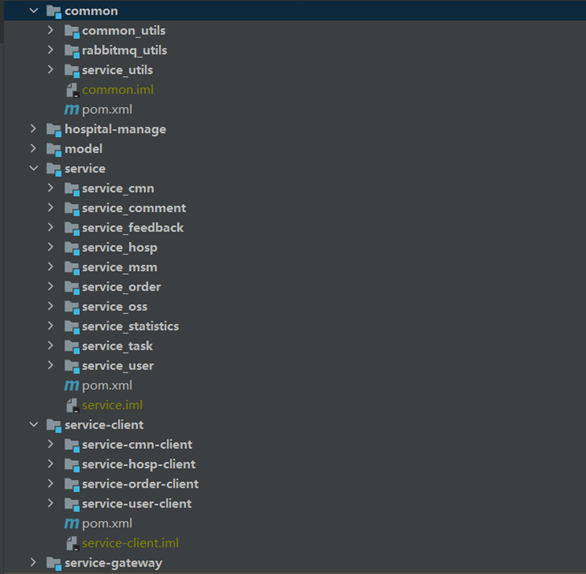

# 陕医通网上预约挂号平台

## 1.1 介绍
系统实现了一套供用户进行网上预约挂号的客户端以及供管理员进行平台相关管理工作的后台管理系统，客户端为用户提供了用户的注册登录、预约挂号和个人信息管理等功能，后台管理员提供了订单管理、医院管理、数据管理、会员管理和统计管理等功能。

## 1.2 技术架构

## 1.3 前端
前端分为用户端和后台管理员端，位于yygu_ui文件夹中，采用nuxt框架进行开发
### 1.3.1 用户端
用户端的文件夹为yygh-site，下面是文件夹中的文件介绍
* .nuxt文件夹中保存的是nuxt框架相关的文件；
* api文件夹中封装了所有对后端接口的请求js文件，里面封装了各种对后端接口访问的功能方法；
* assets文件夹中保存了常用的静态资源，如图片和css样式文件等等；
* layouts文件夹中保存了负责搭建项目整体架构子结构的html结构，保存了包括页头和页脚等组件；
* node_modules包括了下载的各种的依赖文件，如element-ui和axios的依赖pages目录包含应用程序的视图文件
* pages目录包含应用程序的视图文件，分功能保存了各个模块的视图文件，如hospital包中保存与医院相关的视图文件hosp.vue；
* plugins包包含了实例化根组件之前要运行的相关插件；
* utils包中保存了全局公用方法 request.js，其中初始化了axios和拦截器等相关全局工具。

### 1.3.2 管理员端
管理员端的文件夹为yygh-admin
* build包下保存了与构建项目相关的配置文件；
* config包中保存了各种配置js文件，包括开发环境使用的dev.js文件和生产环境使用的prod.js文件，js文件中配置了访问后端的默认接口路径；
* node_modules包中保存了下载的依赖文件，和客户端一致；
* src文件夹为项目主要的文件夹：
  * api、assets、components、router、utils包的功能结构和客户端的基本一致；
  * store包中保存了全局store管理文件；
  * styles包将css样式文件单独分离出来成为了一个包；
  * icons中保存了项目所使用的各种图标；
  * views包的功能和客户端中pages一致，保存了各种视图文件，包括医院管理页面、数据管理页面等等；
  * App.vue为项目的主入口页面，main.js文件为项目主入口文件。

## 1.4 后端
后端采用微服务架构分模块开发，将系统分为六个模块：common、hospital-manage、model、service、service-client、service-gateway

下面为各个模块具体功能的介绍：
* common模块主要功能为向其他模块提供各种工具类:
  * common_utils提供给常用工具类，如全局异常处理类；
  * rabbitmq_utils模块提供了和RabbitMQ消息队列配置相关的工具类，如转换器的配置类MQConfig；
  * service_utils模块主要向service模块提供工具类，如Redis的配置类RedisConfig、MD5加密类等等.
* hospital-manage模块的主要功能为医院模拟接口，采用传统的MVC模式构建了一个医院模拟网站用于模拟挂号平台和医院平台的对接;
* model模块的功能为提供常用的VO类、数据库实体类和枚举类;
* service模块为核心模块，是处理业务的核心微服务模块，其中又分为了十个子模块，每个子模块分别处理不同的业务:
  * servive_cmn为数据字典模块，用于处理数据字典的导入导出，数据字典数据的获取和编码等等；
  * service_comment为评论模块，用于处理用户评论业务，包括评论的修改、保存和添加等等；
  * service_feedback为意见反馈模块，用于处理反馈业务，包括对反馈信息的增删查改操作；
  * service_hosp模块的主要功能为处理来自医院系统与挂号系统对接方面的业务和处理来自用户或后台管理员对医院操作的业务；
  * service_msm模块用于处理短信的发送，主要供其他微服务模块调用，如service_hosp模块和service_order模块；
  * service_order模块用于处理用户订单业务；
  * service_oss模块用于处理文件上传至OSS服务器的业务；
  * service_statistics的主要功能为获取订单统计信息，通过使用feign来调用service_order模块的接口来获取订单统计信息，主要用于管理员来统计订单；
  * service_task为定时任务模块，用于定时处理订单业务，定时向用户发送就诊通知；
  * service_user为用户模块，处理和用户相关的业务。
* service-client模块向service模块提供了基于feign的客户端，用于微服务模块间的互相调用，其中包括了：数据字典模块客户端service-cmn-client、医院模块客户端service-hosp-client、订单模块客户端service-order-client和用户模块客户端service-user-client。
* service-gateway模块提供网关的微服务，所有外部对后端接口的访问都会经过网关转换为对service模块中某个微服务的调用。